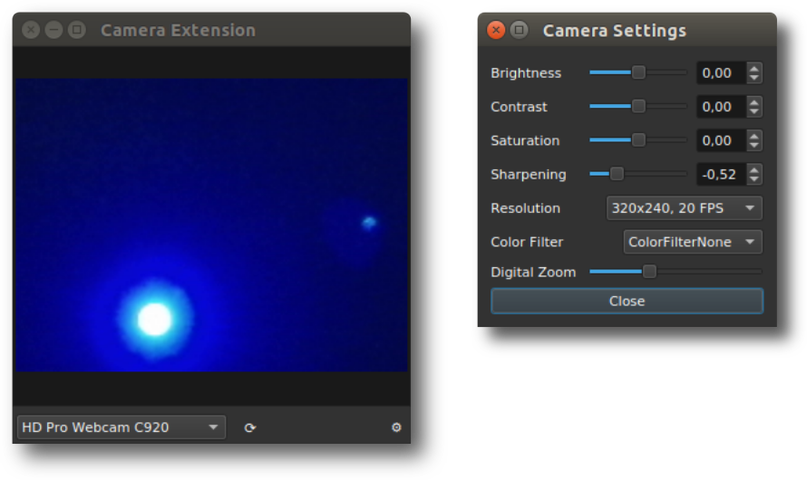

# CameraExtension for OCTproZ
CameraExtension a plugin for [OCTproZ](https://github.com/spectralcode/OCTproZ), providing live view and controls for a camera.  

  

## Features
- Automatic fitting of the camera view to the window size (double-click)
- Rotating (SHIFT + mouse wheel)
- Zooming (CTRL + mouse wheel)
- Recording snapshots (CTRL + S)
- Indicating OCT scan area with overlays (circle, line, rectangle, polygon)
- Various camera settings (brightness, contrast, saturation, sharpening, resolution, and zoom if supported by the used camera)
- The used camera is remembered and automatically selected on restart

## Contributing
Contributions to this CameraExtension are welcome. If you encounter any issues, have suggestions for improvements, or would like to add new features, please feel free to submit a pull request or open an issue.

## License
CameraExtension is licensed under the MIT license. See [LICENSE](LICENSE).
